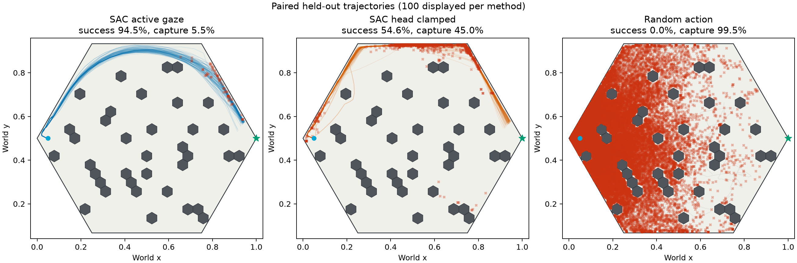
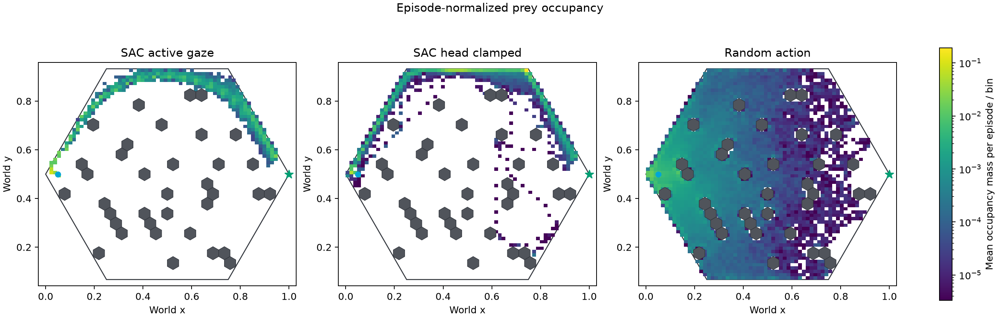
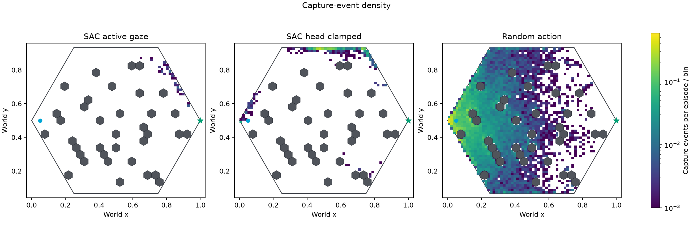
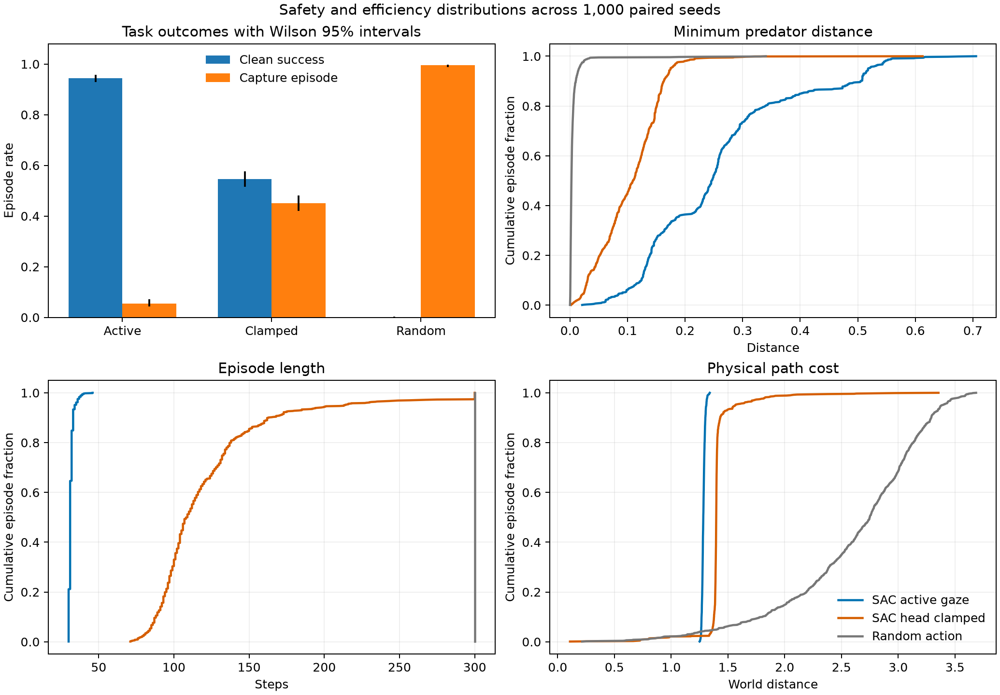
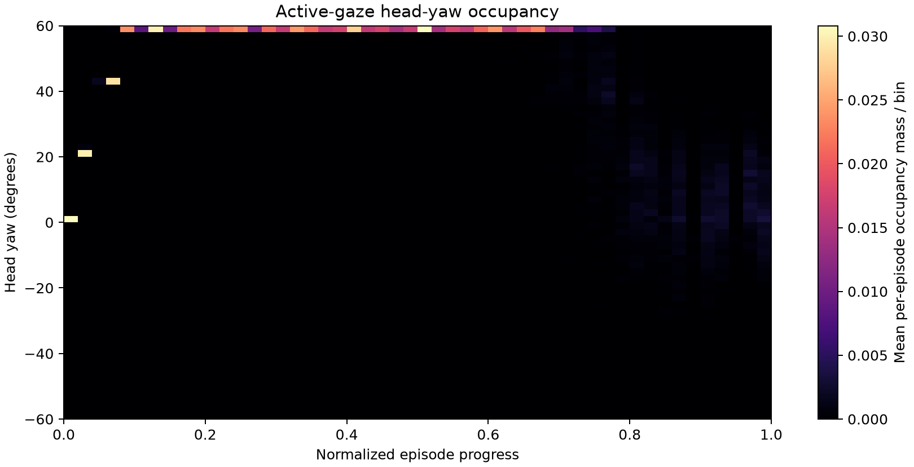

# Binocular SAC: 1,000-seed trajectory-density report

## Scope and attribution

This is a held-out engineering evaluation of the final binocular SAC checkpoint,
not a multi-seed causal claim.

- Training job: `9903898`; training commit: `6c411c619f7aa18d6032fd32bb114baab6c6d1cd`
- Trajectory array: `3755385`; rollout commit: `2ac6f03db426b6acb48a7b32024ee6c1a284f2a7`
- Aggregation job: `3759471`; aggregation commit: `208329fd765a152519a6144b3816726a89c961fd`
- Cohort: seeds `1000000`--`1000999`, paired across all methods
- Scale: 1,000 episodes per method; 3,000 episodes total
- Policy input: `image_left`, `image_right`, `proprio`, `previous_action`
- Action: `[forward_velocity, body_yaw_rate, head_yaw_rate]`

The 30 rollout shards all completed successfully. Trajectories were stored in
flat, pickle-free NPZ files and aggregated only after every shard passed.

## Primary results

| Method | Clean success (Wilson 95% CI) | Capture episode | Goal reach | Mean steps | Mean min distance | Mean path cost |
| --- | ---: | ---: | ---: | ---: | ---: | ---: |
| SAC active gaze | **94.5% [92.9%, 95.8%]** | **5.5%** | 100.0% | **31.52** | **0.258** | **1.284** |
| Same SAC, head clamped | 54.6% [51.5%, 57.7%] | 45.0% | 97.4% | 122.23 | 0.105 | 1.411 |
| Random action | 0.0% [0.0%, 0.4%] | 99.5% | 0.0% | 300.00 | 0.006 | 2.623 |

Active gaze minus head-clamped paired differences:

- clean success: +39.9 percentage points; bootstrap 95% CI `[+36.7, +43.1]`;
- capture episodes: -39.5 points; CI `[-42.9, -36.2]`;
- episode length: -90.71 steps; CI `[-93.40, -88.16]`;
- minimum predator distance: +0.154; CI `[+0.146, +0.161]`;
- path cost: -0.127; CI `[-0.138, -0.117]`.

The exact paired success contingency is:

| Outcome pair | Seeds |
| --- | ---: |
| Both clean successes | 522 |
| Active succeeds, clamped fails | 423 |
| Active fails, clamped succeeds | 24 |
| Both fail | 31 |

Thus the net +399 successes reflects 423 recoveries versus 24 regressions, not
only a difference between two marginal rates.

## Trajectory geometry



The active policy follows a narrow upper-boundary arc from start to goal. Head
clamping retains the same macro-route but causes wider dispersion, interior and
lower excursions, and captures along the initial ascent and top/right corridor.
Random actions diffuse throughout the arena; their capture locations heavily
concentrate in the left half near the start.

Median episode morphology:

| Method | Steps | Minimum predator distance | Path cost | Captures |
| --- | ---: | ---: | ---: | ---: |
| SAC active gaze | 31 | 0.246 | 1.283 | 0 |
| SAC head clamped | 109 | 0.109 | 1.397 | 0 |
| Random action | 300 | 0.0026 | 2.750 | 40 |

The active policy's fifth-percentile minimum distance is 0.091, below the 0.1
puff threshold. Its high mean success therefore coexists with a real 5.5%
capture tail rather than uniform safety.

## Episode-normalized occupancy



Each episode contributes unit occupancy mass before averaging. Consequently,
head-clamped and random episodes cannot dominate the heatmap merely because
they are longer. The active route remains highly concentrated after this
normalization; the clamped route is visibly less stable, and random occupancy
spreads across most free space while remaining biased toward the start side.

## Capture geography



- Active gaze: 73 capture events, median normalized progress 0.806, mean
  position `(0.834, 0.744)` near the final right-hand approach.
- Head clamped: 2,799 events, median progress 0.688, mean position
  `(0.546, 0.906)` along the upper corridor.
- Random: 38,477 events, median progress 0.690, mean position
  `(0.189, 0.494)` near the starting side.

## Safety and efficiency distributions



The ECDFs show distribution-wide separation rather than an improvement driven
by a few episodes. Active trajectories are tightly concentrated around 30--34
steps and path cost about 1.28. Head-clamped episodes have a broad 84--213 step
5th--95th percentile range and a long path-cost tail. Random episodes all reach
the 300-step limit.

## What the learned gaze actually does



The policy does not perform symmetric left-right scanning. It reaches at least
+58 degrees by median normalized progress 0.097 and spends 62.6% of the episode
at that positive limit. It broadens back toward zero mainly in the last quarter.
The high 98.9% active-command rate therefore reflects a sustained biased camera
frame more than sparse threat-triggered peeking.

This changes the scientific interpretation: the experiment strongly
establishes dependence of this trained policy on its head-control channel, but
the benefit may arise from selecting a stable observation frame. The cheapest
next diagnostic is a fixed `+60` degree inference ablation. A causal
active-versus-fixed training claim still requires independently trained matched
policies across multiple training seeds.

## Reproduction and machine-readable summaries

Submit the sharded evaluation and dependent aggregation with:

```bash
bash setup/submit_sac_cnn_density_1000.sh
```

Versioned compact tables:

- [`methods.csv`](artifacts/sac_density_1000/methods.csv)
- [`paired_differences.csv`](artifacts/sac_density_1000/paired_differences.csv)

Large episode JSONL and trace NPZ artifacts remain under
`results/sac/sac_cnn_active_gaze_9903898/trajectory_density_1000_3755385/` and
are intentionally excluded from Git.
